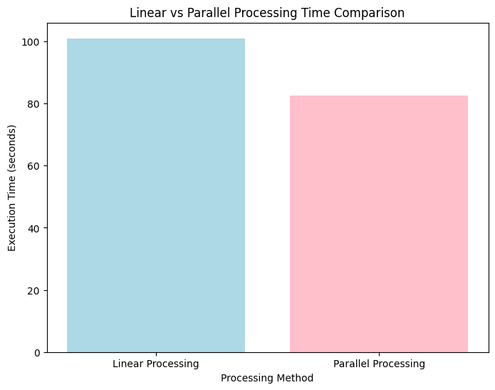

## **Ujala Aleem (21B-104-CS-A)**
---
# Student Fee Submission Analysis: Linear vs Parallel Processing

This project demonstrates the use of linear and parallel processing techniques to analyze student fee submission patterns. The goal is to identify the most common fee submission dates and compare execution times between the two approaches.

---
## **Project Overview**

This project focuses on:
- **Linear Processing**: A step-by-step sequential approach for processing data, suitable for smaller datasets.
- **Parallel Processing**: A faster alternative that uses Python’s `multiprocessing` module, ideal for handling large datasets efficiently.

The project analyzes two CSV files:
1. `students.csv`: Contains student details:
   - `StudentID`: Unique identifier for each student.
   - `Name`: Name of the student.
   - `Gender`: Gender of the student.
   - `EnrollmentYear`: The year the student enrolled.
2. `fees.csv`: Contains fee payment records:
   - `FeeID`: Unique identifier for each fee payment record.
   - `StudentID`: Reference to the student making the payment.
   - `Semester`: Semester for which the fee is paid.
   - `Amount`: Fee amount paid.
   - `PaymentDate`: Date the payment was made.

Both approaches calculate the frequency of fee submission dates and list the most common dates along with their frequencies.

---

## **Directory Structure**

```
Student-Fee-Analysis/
├── data/
│   ├── students.csv   # Student data file
│   ├── fees.csv       # Fee payment data file
├── linear_processing.py  # Linear processing script
├── parallel_processing.py  # Parallel processing script
└── README.md          # Project documentation
```

---

## **How to Run the Project**

### **1. Setup the Environment**
1. Create a virtual environment:
   ```bash
   python -m venv env
   ```
2. Activate the virtual environment:
   - **Windows**:
     ```bash
     env\Scripts\activate
     ```
   - **Mac/Linux**:
     ```bash
     source env/bin/activate
     ```
3. Install the required library:
   ```bash
   pip install pandas
   ```

### **2. Run the Scripts**

#### **For Linear Processing**
Execute the linear processing script:
```bash
python linear_processing.py
```

#### **For Parallel Processing**
Execute the parallel processing script:
```bash
python parallel_processing.py
```

---

## **Execution Results**

### **Linear Processing**
- **Execution Time**: **89.21 seconds**
- **Top 10 Most Common Fee Submission Dates**:
  | Date       | Frequency |
  |------------|-----------|
  | 2024-02-23 | 3609      |
  | 2024-02-16 | 3571      |
  | 2024-02-29 | 3540      |
  | 2024-02-13 | 3526      |
  | 2024-02-17 | 3526      |
  | 2024-02-28 | 3520      |
  | 2024-02-12 | 3500      |
  | 2024-02-11 | 3493      |
  | 2024-02-07 | 3464      |
  | 2024-02-10 | 3452      |

### **Parallel Processing**
- **Execution Time**: **70.60 seconds**
- **Top 10 Most Common Fee Submission Dates**:
  | Date       | Frequency |
  |------------|-----------|
  | 2024-02-23 | 3609      |
  | 2024-02-16 | 3571      |
  | 2024-02-29 | 3540      |
  | 2024-02-13 | 3526      |
  | 2024-02-17 | 3526      |
  | 2024-02-28 | 3520      |
  | 2024-02-12 | 3500      |
  | 2024-02-11 | 3493      |
  | 2024-02-07 | 3464      |
  | 2024-02-10 | 3452      |

# Time Comparison: Linear vs Parallel Processing

Here is a comparison of the execution times between the linear and parallel processing approaches.



---

## **Features**
1. Linear approach to process fee submission data step by step.
2. Parallel approach using Python’s `multiprocessing` module for faster execution.
3. Analysis of the most frequent fee submission dates.
4. Comparison of execution times to demonstrate performance improvements.

---

## **Dependencies**
This project uses:
- **pandas**: For efficient data manipulation and analysis.
- **multiprocessing**: To implement parallel processing.

---
